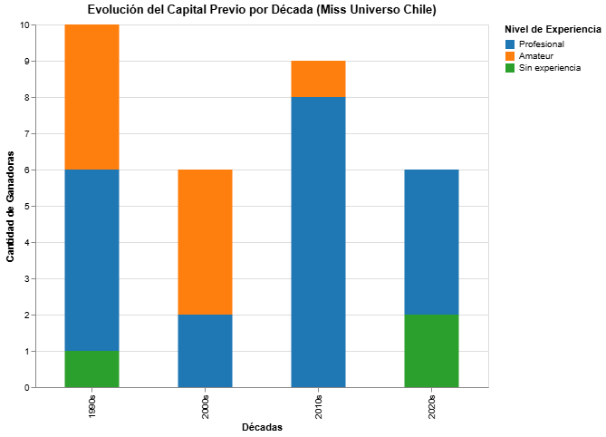

# De amateurs a profesionales: Cómo cambió el perfil de las Miss Chile

Durante mucho tiempo, la historia del Miss Chile fue la de "el diamante en bruto": la idea de que una joven común y corriente podía ser descubierta y transformada en reina de la noche a la mañana. Era un relato romántico que funcionó muy bien en los años 90. Pero, si miramos los datos de las ganadoras desde 1990 hasta hoy, la realidad es otra. Como muestra el gráfico, el concurso dejó de ser una escuela para transformarse en una vitrina para profesionales.

Si nos fijamos en la década de los 90, el gráfico está lleno de candidatas "amateurs". Nombres como Uranía Haltenhoff o Cecilia Alfaro representan ese perfil: jóvenes con desplante, pero que no tenían una carrera real en el modelaje antes de la corona. En esos años, ganar el concurso era el primer paso para hacerse conocida, no el cierre de una trayectoria.

El cambio fuerte empezó a notarse a mediados de los 2000. El caso de Renata Ruiz en 2005 es el mejor ejemplo: ella ya era una modelo profesional de Elite que había triunfado afuera. Su triunfo marcó un antes y un después; desde ahí, tener experiencia previa pasó de ser un detalle a ser casi un requisito para ganar.

Hoy, en los años 2020, esa tendencia ya es total. Si miramos la última barra del gráfico, el nivel profesional se "comió" al resto. Ya no hay espacio para improvisar. Daniela Nicolás llegó siendo actriz, Emilia Dides venía de ganar un programa de talentos en la tele e Ignacia Moll ya era una influencer con millones de seguidores. 

En resumen, los datos confirman que la época de la "vecina de al lado" que se convierte en reina ya pasó. El Miss Universo Chile ahora es una plataforma de consolidación. Como muestra la visualización, hoy el talento ya no se sale a buscar de cero, simplemente se elige a quienes ya saben cómo manejar las cámaras y el público antes de ponerse la banda.
