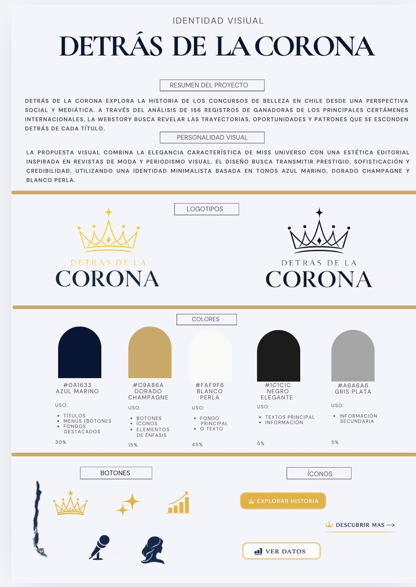
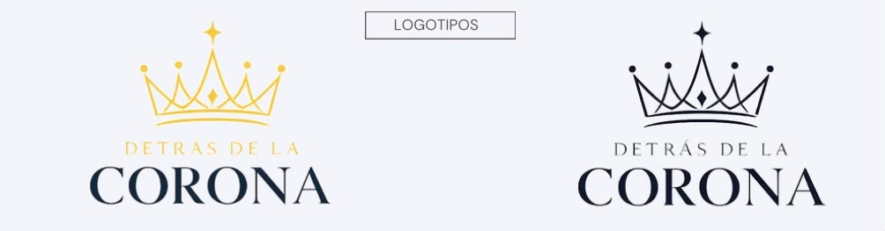
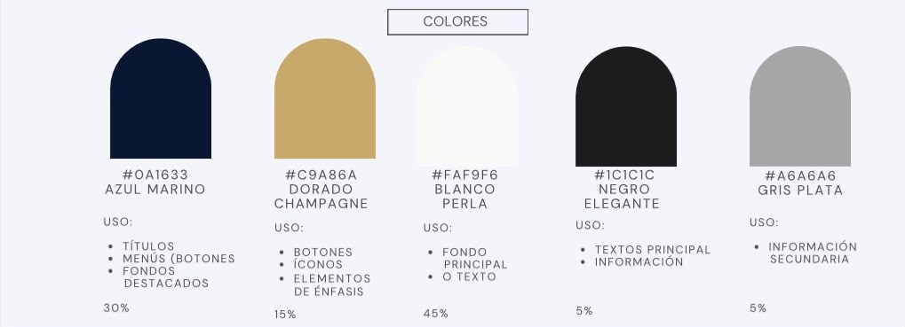
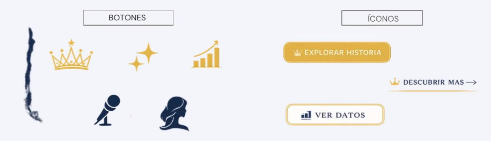

# Análisis del diseño de la historia

## Diseño de la información

La webstory fue concebida como un reportaje de datos desarrollado mediante una narrativa de desplazamiento vertical (*scroll storytelling*). La historia guía al usuario desde casos emblemáticos hacia un análisis basado en datos, permitiendo descubrir progresivamente los patrones presentes en los concursos de belleza en Chile.

El recorrido comienza con figuras ampliamente reconocidas, como Cecilia Bolocco, para introducir la idea de que una corona puede convertirse en una plataforma de visibilidad y reconocimiento público. A medida que el usuario avanza, las visualizaciones explican el origen territorial de las representantes, el nivel de desarrollo de sus comunas, su formación académica y la trayectoria profesional que desarrollaron posteriormente.

Cada visualización fue incorporada para responder una parte del relato, permitiendo que la evidencia sustente la historia periodística.

**Figura 1.** Manual de identidad visual desarrollado para la webstory.

---

# Diseño de la interacción

La navegación fue diseñada mediante un recorrido vertical continuo (*scroll*), permitiendo que el usuario descubra los hallazgos paso a paso.

La estructura alterna texto, fotografías y visualizaciones de datos para mantener un ritmo de lectura dinámico, evitando la sobrecarga de información y favoreciendo la comprensión del contenido.

---

# Relato periodístico

El reportaje fue construido bajo una estructura narrativa interpretativa propia del periodismo de datos.

La historia comienza con casos individuales que resultan familiares para el lector y, posteriormente, amplía el análisis mediante datos que permiten identificar patrones comunes entre las representantes chilenas.

Esta estrategia narrativa busca responder progresivamente la pregunta central del reportaje: **¿Qué hay detrás de una corona?**

---

# Identidad visual

La identidad visual fue inspirada en la estética de Miss Universo y en el diseño editorial de revistas de moda.

Se buscó transmitir elegancia, prestigio y credibilidad mediante un estilo minimalista, donde predominan los espacios en blanco, líneas limpias y una composición equilibrada.

El objetivo fue crear una identidad sofisticada que acompañara la narrativa periodística sin competir con las visualizaciones.

**Figura 2.** Logotipo diseñado para representar la identidad visual del proyecto.

---

# Paleta de colores

La paleta cromática fue seleccionada para reforzar el concepto de elegancia y representación asociado a los concursos de belleza.

- Azul marino (#0A1633): utilizado en títulos, encabezados y fondos principales.
- Dorado champagne (#C9A86A): empleado en botones, íconos y elementos destacados.
- Blanco perla (#FAF9F6): utilizado como fondo principal para favorecer la lectura.
- Gris plata (#A6A6A6): aplicado en información secundaria.
- Negro elegante (#1C1C1C): utilizado para textos de apoyo y elementos informativos.

**Figura 3.** Paleta cromática utilizada en la webstory.

---

# Tipografía

Se seleccionó **Cormorant Garamond** para el logotipo debido a su estilo elegante y editorial.

Para títulos y subtítulos se utilizó **Playfair Display**, mientras que **Inter** fue elegida para textos y datos por su alta legibilidad en plataformas digitales.

Estas tipografías permiten mantener una jerarquía visual clara y coherente con la identidad del proyecto.

---

# Recursos gráficos

Se diseñaron botones, íconos y elementos gráficos inspirados en la estética de los concursos de belleza, utilizando una línea minimalista que mantiene la coherencia visual de la interfaz.

Los botones fueron desarrollados para facilitar la navegación sin perder la identidad elegante de la webstory.

**Figura 4.** Botones e íconos desarrollados para la interfaz.

---

# Ilustraciones y fotografías

Las ilustraciones y recursos gráficos complementan el relato periodístico reforzando la identidad visual del proyecto.

Se utilizaron imágenes con un tratamiento editorial y patrones discretos que aportan elegancia, manteniendo siempre el protagonismo de las visualizaciones y del contenido periodístico.

**Figura 5.** Estilo de ilustraciones y recursos gráficos utilizados en la webstory.

---

# Relación entre diseño y narrativa

Cada decisión de diseño fue tomada para fortalecer el relato periodístico.

La identidad visual busca que el lector asocie inmediatamente la temática de los concursos de belleza con una investigación seria basada en datos. La combinación de una estética elegante con visualizaciones informativas permite comunicar que detrás de la corona existen historias, trayectorias y patrones que trascienden el escenario del certamen.

El diseño, la tipografía, la paleta de colores y los recursos gráficos trabajan de forma conjunta para construir una experiencia coherente, facilitando la lectura y reforzando el mensaje central del reportaje.
